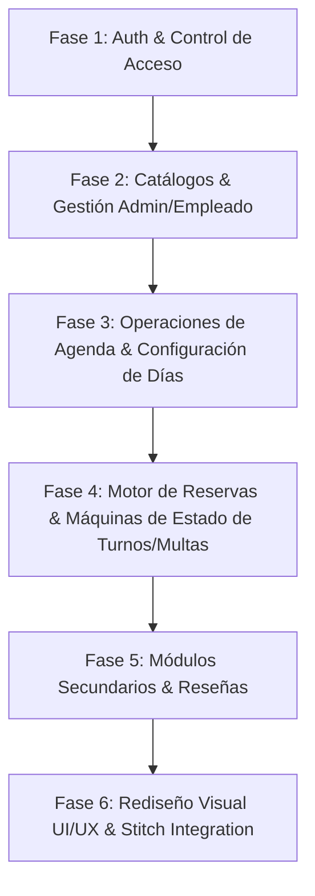

# Plan de Arquitectura y Desarrollo por Fases - Frontend Barberazo

Este documento establece la planificación integral para el desarrollo del Frontend de la aplicación **Barberazo** (Sistema de Gestión de Turnos para Barbería), basada en la especificación de requerimientos, minutas, mapa de navegación, matrices CRUD, modelos de dominio y máquinas de estado del proyecto.

> [!IMPORTANT]
> **Estado del Plan:** **Fase 1** y **Fase 2** completadas con éxito en el código. Listo para comenzar la **Fase 3** (Agenda, Calendario y Configuración de Fechas).  
> **Stack Seleccionado (según DAS E05):** React.js, Material UI (`@mui/material`), React Router v6, Notificaciones con Notistack/Toasts, estado local/global con Context/Redux.

---

## 1. Resumen General de Pantallas y Vistas

A partir del **Mapa de Navegación** (`G24-MNI-MapaDeNavegación-E04.R00.pdf`), los **Casos de Uso (CUU)** y la **Matriz CRUD** (`G24-CRU-MatrizCRUD2-E04-R01.pdf`), se definen las 15 vistas/pantallas del frontend:

| ID Pantalla | Nombre de la Vista / Ruta | Caso de Uso (CUU) Cubierto | Entidades del Modelo de Dominio Manejadas | Operaciones CRUD (según Matriz CRUD 2) |
| :--- | :--- | :--- | :--- | :--- |
| **P01** | **Landing / Raíz** (`/`) | Acceso público general | - | Lectura de estado público |
| **P02** | **Iniciar Sesión** (`/login`) | `CUU1.1` Loguear Usuario | `Cliente`, `Empleado` | `Cliente` (R), `Empleado` (R) |
| **P03** | **Registro de Cliente** (`/registro`) | `CUU2.1` Registrar Cliente | `Cliente` | `Cliente` (C-R) |
| **P04** | **Recuperar Contraseña** (`/recuperar-contrasena`) | `CUU3.1` Recuperar Contraseña | `Cliente` | `Cliente` (R-U) |
| **P05** | **Home / Reservas Cliente** (`/cliente/home`, `/cliente/turnos`) | `CUU1.2` Registrar Turno, `CUU1.5` Cancelar Turno Cliente | `Turno`, `Servicio`, `Empleado`, `diaTrabajo`, `horarioTrabajo`, `Multa` | `Turno` (C-R-U), `Servicio` (R), `Empleado` (R), `diaTrabajo` (R), `horarioTrabajo` (R), `Multa` (R) |
| **P06** | **Mis Multas Cliente** (`/cliente/multas`) | `CUU4.1` Pagar Multa | `Multa`, `Cliente` | `Multa` (R-U), `Cliente` (R-U) |
| **P07** | **Perfil de Cliente** (`/cliente/perfil`) | `CUU9.1` Editar Perfil, `CUU9.2` Eliminar Perfil | `Cliente` | `Cliente` (R-U, R-D) |
| **P08** | **Dejar Reseña** (`/cliente/resena/:turnoId`) | `CUU1.4` Completar Reseña | `Reseña`, `Turno` | `Reseña` (C), `Turno` (R) |
| **P09** | **Dashboard / Turnos Dueño** (`/dueno/home`, `/dueno/turnos`) | `CUU1.1`, `CUU1.3` Confirmar Asistencia, `CUU1.6` Cancelar Turno Dueño | `Turno`, `Cliente`, `Empleado`, `diaTrabajo`, `horarioTrabajo`, `Cancelación`, `Multa` | `Turno` (R-U), `Cliente` (R-U), `Empleado` (R), `Cancelación` (C), `Multa` (C) |
| **P10** | **Gestión de Clientes** (`/dueno/clientes`, `/empleado/clientes`) | `CUU5.1` Bloquear Cliente, `CUU5.2` Desbloquear Cliente | `Cliente`, `Empleado` | `Cliente` (R-U), `Empleado` (R) |
| **P11** | **Gestión de Servicios** (`/dueno/servicios`) | `CUU7.1` Crear Servicios, `CUU7.2` Editar Servicios | `Servicio`, `Empleado` | `Servicio` (C-R, R-U), `Empleado` (R) |
| **P12** | **Gestión de Empleados y Horarios** (`/dueno/empleados`) | `CUU10.1` Asignar Empleado, `CUU10.2` Editar Empleado, `CUU10.3` Eliminar Empleado, `CUU6.3` Asignar Horario Empleado | `Empleado`, `horarioTrabajo`, `diaTrabajo` | `Empleado` (C-R, R-U, R-D), `horarioTrabajo` (C-R-U-D), `diaTrabajo` (R) |
| **P13** | **Habilitación de Calendario** (`/dueno/fechas`) | `CUU6.1` Habilitar Fecha, `CUU6.2` Deshabilitar Fecha | `diaTrabajo`, `Turno`, `Cancelación` | `diaTrabajo` (R-U), `Turno` (R-U), `Cancelación` (C) |
| **P14** | **Consulta de Reseñas** (`/dueno/resenas`, `/empleado/resenas`) | `CUU8.1` Consultar Reseñas | `Reseña`, `Empleado` | `Reseña` (R), `Empleado` (R) |
| **P15** | **Dashboard Empleado** (`/empleado/home`) | `CUU1.3` Confirmar Asistencia, `CUU1.6` Cancelar Turno Dueño | `Turno`, `Cliente`, `Empleado`, `diaTrabajo` | `Turno` (R-U), `Cliente` (R-U), `Empleado` (R) |

---

## 2. Fases de Desarrollo Incremental

---

### Fase 1: Autenticación, Registro y Control de Acceso por Roles
- **Objetivo:** Implementar la infraestructura de enrutamiento protegido, persistencia de sesión por token JWT/Mock y las pantallas de ingreso y registro de usuarios con control de roles (`Cliente`, `Empleado`, `Dueño`).
- **Pantallas / Componentes:**
  - `P01 - Landing Page` (`/`)
  - `P02 - Login` (`/login`)
  - `P03 - Registro de Cliente` (`/registro`)
  - `P04 - Recuperar Contraseña` (`/recuperar-contrasena`)
  - Componentes reutilizables: `AuthLayout`, `ProtectedRoute`, `RoleGuard`, `Header/Navbar`.
- **Casos de Uso Cubiertos:** `CUU1.1` (Loguear Usuario), `CUU2.1` (Registrar Cliente), `CUU3.1` (Recuperar Contraseña).
- **Dependencias:** Ninguna (Fase base).
- **Estados / Transiciones (Máquina de Estados de Clientes):**
  - Registro de cliente -> Estado inicial `Registrado`.
  - Confirmación de código de correo (5 min) -> Estado `Activo`.
- **Reglas de Negocio a Validar:**
  - Formato estricto de e-mail y contraseña.
  - Validación de coincidencia de contraseña y envío de código de verificación en el registro (`CUU2.1`).
  - Login directo con usuario y contraseña (sin código repetido en cada login).
  - Redirección automática según el rol recibido tras el login (`Cliente` -> `/cliente/home`, `Dueño` -> `/dueno/home`, `Empleado` -> `/empleado/home`).
- **Criterios de Aceptación:**
  - Un cliente no registrado puede completar el formulario y confirmar su registro.
  - Un usuario bloqueado o sin credenciales correctas recibe el mensaje de error correspondiente.
  - Las rutas protegidas impiden el acceso no autorizado entre roles.

---

### Fase 2: Mantenimiento de Catálogos y Entidades Principales (ABM Admin & Empleado)
- **Objetivo:** Construir los módulos de gestión para que el Dueño administre Servicios, Empleados, Clientes y Horarios de Trabajo (y el Empleado acceda en modo lectura a Clientes y Servicios).
- **Pantallas / Componentes:**
  - `P10 - Gestión de Clientes` (`/dueno/clientes`, `/empleado/clientes`)
  - `P11 - Gestión de Servicios` (`/dueno/servicios`)
  - `P12 - Gestión de Empleados` (`/dueno/empleados`)
  - Componentes: `DataTable`, `FormModal`, `ConfirmDialog`, `StatusBadge`.
- **Casos de Uso Cubiertos:** `CUU5.1` (Bloquear Cliente), `CUU5.2` (Desbloquear Cliente), `CUU7.1` (Crear Servicio), `CUU7.2` (Editar Servicio), `CUU10.1` (Asignar Empleado), `CUU10.2` (Editar Empleado), `CUU10.3` (Eliminar Empleado).
- **Dependencias:** Fase 1 (Autenticación y Layouts por Rol).
- **Estados / Transiciones (Máquinas de Estado):**
  - **Servicios:** Creación -> `Habilitado`. Acción del Dueño -> `Deshabilitado` / `Habilitado`.
  - **Clientes:** Transición `Activo` <-> `Bloqueado` detonada por Dueño/Empleado (con restricción: *el Empleado solo visualiza y NO puede bloquear*).
- **Reglas de Negocio a Validar:**
  - El Dueño puede dar de alta N empleados.
  - El Empleado puede visualizar la lista de clientes y servicios, pero los botones de acción de crear/editar o bloquear están deshabilitados/ocultos.
  - Duración de servicios parametrizable en minutos.
- **Criterios de Aceptación:**
  - ABM completo de empleados y servicios funcional.
  - Vistas adaptadas según el rol activo.

---

### Fase 3: Operaciones de Agenda, Calendario y Configuración de Fechas
- **Objetivo:** Desarrollar el calendario de trabajo del negocio, la asignación de franjas horarias por empleado y la habilitación/deshabilitación de fechas de atención.
- **Pantallas / Componentes:**
  - `P13 - Habilitación de Fechas y Horarios` (`/dueno/fechas`)
  - Subcomponente de Horarios en `P12 - Gestión de Empleados` (Asignación `horarioTrabajo`).
  - Componentes: `CalendarPicker`, `TimeSlotPicker`, `DayConfigCard`.
- **Casos de Uso Cubiertos:** `CUU6.1` (Habilitar Fecha), `CUU6.2` (Deshabilitar Fecha), `CUU6.3` (Asignar Horario a Empleado).
- **Dependencias:** Fases 1 y 2.
- **Estados / Transiciones (Máquina de Estados de díaTrabajo):**
  - Creación -> `Deshabilitada`.
  - Dueño habilita fecha -> `Habilitado`.
  - Dueño deshabilita fecha -> `Deshabilitada`.
- **Reglas de Negocio a Validar:**
  - Horario por defecto del negocio: Martes a Sábados (08:00 - 12:00 y 14:00 - 20:00). Días feriados/no laborables cerrados.
  - Al deshabilitar una fecha previamente habilitada con turnos agendados, el sistema notifica y gestiona las cancelaciones.
- **Criterios de Aceptación:**
  - El Dueño puede configurar días laborales y horarios por empleado.

---

### Fase 4: Motor de Reservas y Gestión del Ciclo de Vida del Turno (Strikes, Multas & Mercado Pago)
- **Objetivo:** Implementar la experiencia del cliente para reservar turnos (con opción de "Cualquier empleado disponible"), y la consola de gestión de turnos con asistencias, inasistencias, cancelaciones, strikes y simulación de pago con Mercado Pago.
- **Pantallas / Componentes:**
  - `P05 - Home / Reservas Cliente` (`/cliente/home`)
  - `P06 - Mis Multas Cliente` (`/cliente/multas`)
  - `P09 - Dashboard Dueño` (`/dueno/home`)
  - `P15 - Dashboard Empleado` (`/empleado/home`)
  - Componentes: `BookingWizard`, `TurnoCard`, `StrikeCounter`, `MercadoPagoModal`.
- **Casos de Uso Cubiertos:** `CUU1.2` (Registrar Turno), `CUU1.3` (Confirmar Asistencia), `CUU1.5` (Cancelar Turno Cliente), `CUU1.6` (Cancelar Turno Dueño/Empleado), `CUU4.1` (Pagar Multa).
- **Dependencias:** Fases 1, 2 y 3.
- **Estados / Transiciones (Máquinas de Estado):**
  - **Turnos:** `Cliente solicita turno` -> `Solicitado`.
    - Asistencia confirmada -> `Asistido`.
    - Inasistencia confirmada -> `No-Asistido` (+1 Strike).
    - Cancelación cliente < 24hs -> `Cancelado` (+1 Strike).
    - Cancelación cliente > 24hs -> `Cancelado` (Sin penalty).
  - **Multas & Clientes:**
    - Al llegar a 3 strikes -> Generación de Multa (`Pendiente`) y cliente pasa a `Multado`.
    - Pago de multa vía simulación/integración Mercado Pago -> Multa pasa a `Pagada`, reseteo de strikes a 0 y cliente retorna a `Activo`.
- **Reglas de Negocio a Validar:**
  - **Un cliente solo puede tener 1 turno activo a la vez.**
  - **Permitir elegir un empleado específico O seleccionar "Cualquier empleado disponible".**
  - **Bloqueo estricto de reserva de turnos si el cliente está Multado o Bloqueado.**
- **Criterios de Aceptación:**
  - Flujo de reserva con o sin preferencia de empleado.
  - Ciclo de 3 strikes genera la multa, bloquea reservas y requiere el flujo de pago Mercado Pago para rehabilitar al cliente.

---

### Fase 5: Casos de Uso Secundarios, Sobreturnos y Reseñas
- **Objetivo:** Completar funciones secundarias como la gestión de sobreturnos con advertencia de solapamiento, edición de perfil y recepción de reseñas.
- **Pantallas / Componentes:**
  - `P07 - Perfil de Cliente` (`/cliente/perfil`)
  - `P08 - Dejar Reseña` (`/cliente/resena/:turnoId`)
  - `P14 - Consulta de Reseñas` (`/dueno/resenas`, `/empleado/resenas`)
  - Componentes: `SobreturnoModal` (con advertencia de superposición), `StarRating`, `ReviewCard`.
- **Casos de Uso Cubiertos:** `CUU1.4` (Completar Reseña), `CUU8.1` (Consultar Reseñas), `CUU9.1` (Editar Perfil), `CUU9.2` (Eliminar Perfil).
- **Dependencias:** Fases 1 a 4.
- **Reglas de Negocio a Validar:**
  - **Sobreturnos con advertencia:** El sistema valida si el sobreturno se solapa con un turno existente. Emite un aviso en pantalla ("Horario solapado"); si el Dueño/Empleado confirma, se registra el sobreturno sin bloquearlo.
  - Formulario de reseña disponible solo para turnos con estado `Asistido`.
- **Criterios de Aceptación:**
  - Sobreturno registrable incluso con solapamiento tras la confirmación explícita del usuario.
  - Sistema de reseñas funcional y visible por el staff.

---

### Fase 6: Rediseño Visual UI/UX Premium (Integración con Stitch & Design System)
- **Objetivo:** Elevar la calidad estética del frontend aplicando un diseño moderno (Material UI personalizado, paleta armónica de barbería, modo oscuro/claro, glassmorphism, micro-animaciones y layouts totalmente responsive).
- **Criterios de Aceptación:**
  - UI visualmente atractiva y pulida.
  - Ninguna regla de negocio ni flujo funcional se rompe al aplicar los estilos.

---

## 3. Resoluciones de Riesgos y Confirmaciones del Usuario

1. **Permisos de Empleado (Resuelto):**  
   Confirmado que el empleado tiene acceso visual (modo lectura) a Clientes y Servicios en la navegación, pero no puede editar horarios, crear servicios ni bloquear clientes.
2. **Flujo de Verificación en 2 Pasos (Resuelto):**  
   Confirmado que el código de verificación por correo aplica **exclusivamente al Registro (`CUU2.1`)**. El inicio de sesión habitual se realiza directamente con usuario y contraseña.
3. **Sincronización de Estados de Multa y Cliente (Resuelto):**  
   Se mantendrán sincronizadas de forma atómica las máquinas de estado del Cliente (`Activo` <-> `Multado`) y de la Multa (`Pendiente` -> `Pagada`).

---

## 4. Respuestas a Preguntas Abiertas

1. **Pasarela de Pago de Multas (Mercado Pago):**  
   Se integrará la experiencia de pago simulando el flujo de **Mercado Pago** (mediante modal / botón de pago oficial de Mercado Pago), evitando solicitar datos de tarjeta de crédito directamente en la app.
2. **Preferencia de Empleado en Reservas:**  
   Se incluirá la opción de elegir a un empleado específico o seleccionar la opción **"Sin preferencia / Cualquier empleado disponible"**.
3. **Validación de Sobreturnos Solapados:**  
   Al intentar agendar un sobreturno en un horario ocupado, la interfaz desplegará una **advertencia de solapamiento**. Si el Empleado/Dueño confirma que desea continuar, el sobreturno se registrará con éxito.

---

## Plan de Verificación

### Pruebas Automatizadas
- Pruebas unitarias de componentes y validadores de formulario con Vitest/React Testing Library.
- Pruebas de integración de flujos de reserva y máquinas de estado.

### Verificación Manual
- Navegación por roles (`Cliente`, `Empleado`, `Dueño`).
- Simulación completa del ciclo de vida del turno: Reserva -> Inasistencia/Cancelación <24h -> Acumulación de 3 Strikes -> Bloqueo por Multa -> Pago Mercado Pago -> Desbloqueo.
- Prueba de advertencia de solapamiento en sobreturnos.
